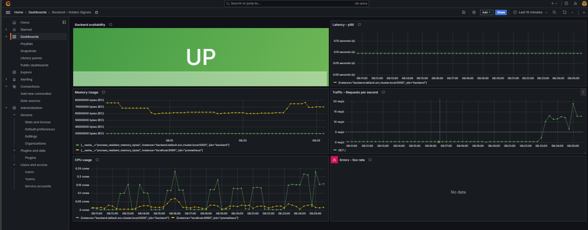
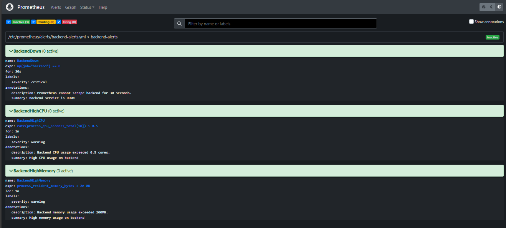
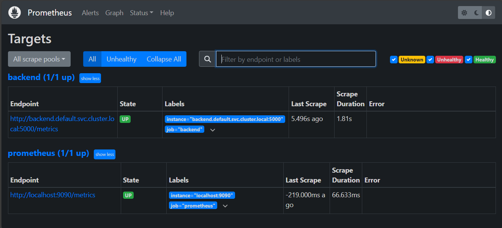

## 🚀 Docker Compose → Kubernetes → SRE Observability Project
### 📌 Project Summary
This project demonstrates a production-style microservices application built using Docker, Kubernetes, and SRE best practices.

It showcases the complete DevOps/SRE lifecycle:

- Containerization
- Kubernetes orchestration
- Autoscaling (HPA)
- Monitoring & alerting
- Golden Signals dashboards
- Failure testing & resilience

This repository is designed as a portfolio-ready project for Junior Cloud / DevOps / SRE roles.

---

## 🧱 System Architecture

Architecture Overview
- Frontend Service – Client-facing web app
- Backend Service (Flask API) – Serves API + Prometheus metrics
- Kubernetes (Minikube) – Orchestration & self-healing
- Prometheus – Metrics collection & alerting
- Grafana – Visualization (Golden Signals dashboard)
- Horizontal Pod Autoscaler (HPA) – CPU-based autoscaling

---

## 🐳 Containerization

- Dockerfiles for backend & frontend
- Local development via Docker Compose
- CI-based builds via GitHub Actions
- Images pushed automatically to Docker Hub

---

## ☸️ Kubernetes Deployment

Core Features
- Deployments & Services
- Resource requests & limits
- Liveness & readiness probes
- Kubernetes self-healing
- Metrics Server enabled

Autoscaling (HPA)

- Backend automatically scales based on CPU utilization
- Verified via kubectl top and live load testing

---

## 🧱 Architecture Overview

```
User
│
▼
NGINX Ingress
│
├── Frontend Service (NGINX)
│
└── Backend Service (Python API)
│
▼
Prometheus Metrics (/metrics)
│
▼
Prometheus
│
▼
Grafana

```
---

### Architecture


### Flow Overview
1. User traffic enters through **NGINX Ingress Controller**
2. Ingress routes requests to:
   - **Frontend Service** (NGINX static UI)
   - **Backend Service** (Python API)
3. Backend exposes `/metrics`
4. **Prometheus** scrapes metrics
5. **Grafana** visualizes metrics & alerts

---

## 🛠 Tech Stack

| Category | Tools |
|--------|------|
| Containers | Docker |
| CI/CD | GitHub Actions |
| Orchestration | Kubernetes (Minikube) |
| Networking | Kubernetes Services, Ingress |
| Monitoring | Prometheus |
| Visualization | Grafana |
| Alerts | Prometheus Alert Rules |

---

## Containerization Strategy

### Backend
- Python 3.11 base image
- Optimized layers
- Exposes `/metrics` for Prometheus

### Frontend
- NGINX Alpine image
- Static frontend served via NGINX
- Lightweight and production-ready

---

# 🧪 Run Locally (Dev/Test)

### Option 1: Docker Compose
```bash
docker compose up -d
```
### Option 2: Kubernetes (Minikube)
```bash
minikube start
kubectl apply -f k8s/
```

Access services via Ingress or port-forwarding.

Access:

- Frontend → http://localhost:…
- Backend → curl/port-forward…

---

## 📊 Observability – Golden Signals (Grafana)

The Grafana dashboard implements SRE Golden Signals:

Panels Included:

1. Availability – Backend UP / DOWN
2. Traffic – Requests per second (RPS)
3. Latency – P95 request latency
4. CPU Usage – Saturation
5. Memory Usage – Saturation
6. Errors – 5xx error rate (no errors observed)

### 📸 Dashboard Screenshot:



---

## 🚨 Monitoring & Alerting (Prometheus)

Prometheus is configured with custom alert rules:

Alert Rules:

- BackendDown – Service unavailable
- BackendHighCPU – CPU usage threshold breached
- BackendHighMemory – Memory usage exceeded

### 📸 Prometheus Alerts View:



### 📸 Prometheus Targets Status:



---

## 📊 Live Grafana Dashboard (Snapshot)

🔗 **Public Read-Only Snapshot**  
https://snapshots.raintank.io/dashboard/snapshot/s1jwnixPQ1TxIXAnT3MB35mmSAu9Xf94?orgId=0

> This snapshot shows Golden Signals monitoring for the backend service:
> - Traffic (RPS)
> - Error Rate
> - Latency
> - CPU & Memory usage
> - Service Availability


---

## 🧪 Failure Testing & Resilience

Tests Performed

- Manually deleted backend pods
- Kubernetes recreated pods automatically
- Temporary request failures observed
- Prometheus metrics reflected downtime
- Grafana availability panel updated in real time

This validates:

- Kubernetes self-healing
- Monitoring accuracy
- Alert readiness

### 📸 Failure / Recovery Evidence:

---

## 📈 Backend Metrics

The backend exposes Prometheus metrics at:

```bash
/metrics
```

Metrics Collected

- HTTP request count
- Request latency histogram
- CPU usage
- Memory usage

Metrics are scraped directly by Prometheus

---

## 🔄 CI/CD Pipeline

GitHub Actions workflow performs:

- Image build (frontend & backend)
- Tagging
- Push to Docker Hub
- Triggered on every push to main

📸 GitHub Actions CI Run:

---

## 📂 Repository Structure
 
```bash
.
├── backend/
│   └── app.py
├── frontend/
├── docker-compose.yml
├── k8s/
│   ├── backend/
│   ├── frontend/
│   └── monitoring/
├── prometheus/
│   └── alerts/
├── screenshots/
│   ├── architecture.png
│   ├── grafana-golden-signals.png
│   ├── prometheus-alerts.png
│   ├── prometheus-targets.png
│   ├── failure-testing.png
│   └── github-actions-ci.png
└── README.md

```

---

## 🎯 Skills Demonstrated

- Docker & container best practices
- Kubernetes deployments & autoscaling
- Prometheus metrics & alerting
- Grafana dashboards (Golden Signals)
- Failure testing & resilience engineering
- CI/CD automation with GitHub Actions
- Production & SRE mindset 

---


