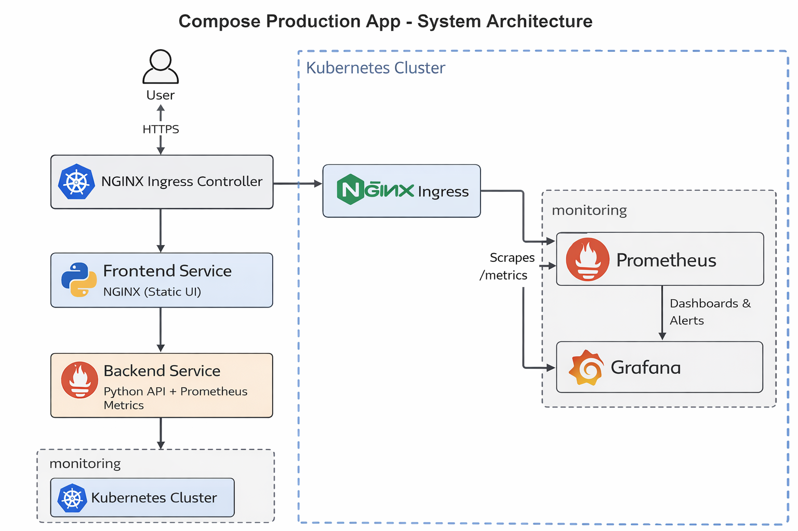

# Docker Compose Production App

Production-style microservices application deployed on Kubernetes
with CI/CD, monitoring, and alerting.

---

## 🚀 Project Overview

This project consists of:
- A **Python backend API** exposing business logic and Prometheus metrics
- An **NGINX-based frontend** consuming the backend
- **Dockerized services** with production-ready images
- **CI/CD pipeline** using GitHub Actions
- **Kubernetes deployment** with Ingress
- **Monitoring & alerting** using Prometheus and Grafana

The goal is to demonstrate **end-to-end DevOps & SRE workflows**, not just application code.

---

## 🧱 Architecture Overview

```
User
│
▼
NGINX Ingress
│
├── Frontend Service (NGINX)
│
└── Backend Service (Python API)
│
▼
Prometheus Metrics (/metrics)
│
▼
Prometheus
│
▼
Grafana

```
---


## 🏗 System Architecture

This project demonstrates a production-style containerized application deployed on Kubernetes with observability.

### High-level Architecture


### Flow Overview
1. User traffic enters through **NGINX Ingress Controller**
2. Ingress routes requests to:
   - **Frontend Service** (NGINX static UI)
   - **Backend Service** (Python API)
3. Backend exposes `/metrics`
4. **Prometheus** scrapes metrics
5. **Grafana** visualizes metrics & alerts

---

## 🛠 Tech Stack

| Category | Tools |
|--------|------|
| Containers | Docker |
| CI/CD | GitHub Actions |
| Orchestration | Kubernetes (Minikube) |
| Networking | Kubernetes Services, Ingress |
| Monitoring | Prometheus |
| Visualization | Grafana |
| Alerts | Prometheus Alert Rules |

---

## 🔄 CI/CD Pipeline (GitHub Actions)

The pipeline automatically:
1. Triggers on `git push` to `main`
2. Builds Docker images for:
   - Backend
   - Frontend
3. Tags images with version
4. Pushes images to **Docker Hub**
5. Uses **GitHub Secrets** for credentials

### 🔐 Secrets Used
- `DOCKERHUB_USERNAME`
- `DOCKERHUB_TOKEN`

This ensures **secure, automated image delivery**.

---

## 📦 Containerization Strategy

### Backend
- Python 3.11 base image
- Optimized layers
- Exposes `/metrics` for Prometheus

### Frontend
- NGINX Alpine image
- Static frontend served via NGINX
- Lightweight and production-ready

---

## ☸️ Kubernetes Deployment

- **Deployments** for backend & frontend
- **Services** for internal discovery
- **Ingress (NGINX)** for external access
- **Rolling updates** supported
- **Namespace isolation** (`monitoring`)

---

## 📊 Monitoring & Alerting (SRE Focus)

### Metrics Collected
- Service availability (`up`)
- CPU usage
- Memory usage
- Process metrics

### Alerts Configured
| Alert | Condition |
|-----|----------|
| BackendDown | Backend unavailable for 30s |
| BackendHighCPU | CPU usage > threshold |
| BackendHighMemory | Memory > 200MB |

Grafana dashboards visualize:
- CPU
- Memory
- Uptime
- Service health

---

## 🧪 Run Locally (Dev/Test)

### Option 1: Docker Compose
```bash
docker compose up -d
```
### Option 2: Kubernetes (Minikube)
```bash
minikube start
kubectl apply -f k8s/
```

Access services via Ingress or port-forwarding.

---

## 🧠 Key Learnings

- Designing production-ready Docker images
- CI/CD automation with GitHub Actions
- Kubernetes service discovery & ingress
- Prometheus metrics & alert rules
- Debugging real CI and deployment issues
- Observability-first mindset (SRE principles)

---

## 📌 Future Improvements

- Add Horizontal Pod Autoscaling (HPA)
- Introduce Helm charts
- Centralized logging (ELK / Loki)
- Canary deployments
- Multi-environment CI (dev/stage/prod)

---


Aspiring Junior Cloud / DevOps / SRE Engineer (2025)
